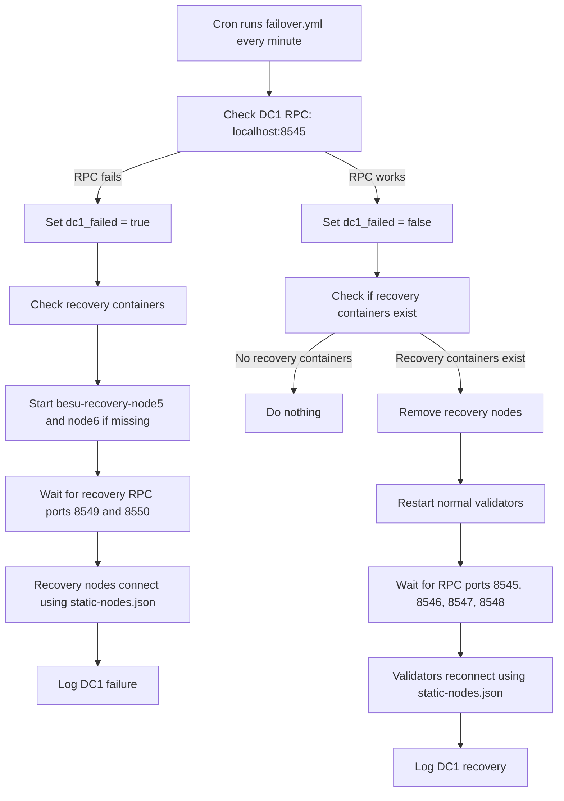

# Ansible Beginner Guide For This Besu Network

This guide explains how Ansible is used in this project to deploy, monitor, fail over, and fail back a Hyperledger Besu QBFT network across two simulated data centers.

The goal is to make the disaster recovery automation understandable if you are new to Ansible.

## What Ansible Does

Ansible is an automation tool. In this project it runs shell commands, Docker commands, and HTTP health checks for the Besu network.

This project uses Ansible to:

- start DC1 and DC2 Besu containers
- check whether Besu RPC endpoints are healthy
- detect when DC1 is down
- start replacement recovery nodes in DC2
- connect recovery nodes to surviving DC2 peers using static peer files
- remove recovery nodes when DC1 comes back
- reconnect and restart validators during failback

## Important Files

The Ansible files are in `network/ansible/`.

```text
network/
  ansible/
    inventory.yml
    group_vars/
      dc1.yml
      dc2.yml
    playbooks/
      deploy.yml
      healthcheck.yml
      failover.yml
  dc1/
    docker-compose.yml
  dc2/
    docker-compose.yml
```

## Inventory

The inventory tells Ansible what hosts exist.

File: `ansible/inventory.yml`

```yaml
all:
  children:
    dc1:
      hosts:
        dc1-server:
          ansible_host: localhost
          ansible_connection: local
          compose_dir: "{{ inventory_dir }}/../dc1"
    dc2:
      hosts:
        dc2-server:
          ansible_host: localhost
          ansible_connection: local
          compose_dir: "{{ inventory_dir }}/../dc2"
```

Although the names are `dc1-server` and `dc2-server`, both use `localhost` in this experiment. That means Ansible runs commands on your local machine, not over SSH.

The two data centers are simulated with Docker Compose directories:

- `dc1-server` uses `network/dc1`
- `dc2-server` uses `network/dc2`

## Group Variables

Group variables define settings for all hosts in a group.

File: `ansible/group_vars/dc1.yml`

```yaml
dc: dc1
nodes:
  - name: dc1-node1
    rpc_port: 8545
    p2p_port: 30303
  - name: dc1-node2
    rpc_port: 8546
    p2p_port: 30304
```

File: `ansible/group_vars/dc2.yml`

```yaml
dc: dc2
nodes:
  - name: dc2-node3
    rpc_port: 8547
    p2p_port: 30305
  - name: dc2-node4
    rpc_port: 8548
    p2p_port: 30306
```

These variables are used by the health check playbook to loop through nodes and test their RPC ports.

## Playbooks

An Ansible playbook is a YAML file containing plays and tasks.

A play says which hosts to run on.

A task says what to do.

### Deploy Playbook

File: `ansible/playbooks/deploy.yml`

This starts Docker Compose in both data center directories.

```yaml
- name: Deploy DC1
  hosts: dc1
  tasks:
    - name: Start DC1 containers
      command: docker compose up -d
      args:
        chdir: "{{ compose_dir }}"
```

The important parts are:

- `hosts: dc1` means run this play on the DC1 inventory group.
- `command: docker compose up -d` starts containers.
- `chdir: "{{ compose_dir }}"` runs the command inside the correct Docker Compose directory.

Run it manually:

```bash
ansible-playbook ansible/playbooks/deploy.yml -i ansible/inventory.yml
```

### Health Check Playbook

File: `ansible/playbooks/healthcheck.yml`

This checks all configured Besu RPC ports.

It sends a JSON-RPC request:

```json
{
  "jsonrpc": "2.0",
  "method": "eth_blockNumber",
  "params": [],
  "id": 1
}
```

If a node responds, Ansible prints the block number. If it cannot connect, it prints `UNREACHABLE`.

Run it manually:

```bash
ansible-playbook ansible/playbooks/healthcheck.yml -i ansible/inventory.yml
```

## Disaster Recovery Playbook

File: `ansible/playbooks/failover.yml`

This is the main automation for the experiment.

It handles two situations:

- DC1 is down, so recovery nodes must start in DC2.
- DC1 is back, so recovery nodes must be removed and validators must be reconnected.

## Failover Flow

Failover means DC1 is down and DC2 must keep the blockchain running.

The playbook first checks DC1 health:

```yaml
- name: Check dc1-node1 RPC
  uri:
    url: "http://localhost:8545"
    method: POST
    body_format: json
    body:
      jsonrpc: "2.0"
      method: "eth_blockNumber"
      params: []
      id: 1
    timeout: 5
  register: dc1_health
  ignore_errors: true
```

Then it stores a fact:

```yaml
- name: Set DC1 failed fact
  set_fact:
    dc1_failed: "{{ dc1_health.failed | bool }}"
```

If DC1 RPC is unreachable, `dc1_failed` becomes `true`.

When `dc1_failed` is `true`, the playbook starts two recovery containers in DC2:

- `besu-recovery-node5`
- `besu-recovery-node6`

These containers reuse DC1 validator keys:

- `besu-recovery-node5` uses `dc1-node1` keys
- `besu-recovery-node6` uses `dc1-node2` keys

This lets DC2 temporarily host replacement validators for the failed DC1 validators.

After starting recovery nodes, Besu connects them to the surviving DC2 peers using mounted `static-nodes.json` files from `network/static-peers/`.

This step is important because Docker peer discovery is not always enough. A recovery node may be healthy at the RPC level but still have zero peers and stay stuck at block `0x0`.

This design does not use `admin_addPeer`. The `ADMIN` RPC API is intentionally not enabled because it is too powerful for production-style operation.

## Failback Flow

Failback means DC1 has returned and the network should move back to the normal four-validator topology.

The playbook detects DC1 recovery when `http://localhost:8545` responds again.

When DC1 is healthy and recovery containers exist, the playbook:

- removes `besu-recovery-node5`
- removes `besu-recovery-node6`
- restarts the four normal validators
- waits for their RPC endpoints
- restarts validators so they reload static peer files and reconnect through the configured topology
- writes a recovery log entry

The validator restart is important in this experiment because DC1 may be restarted while recovery nodes with the same validator keys are still running. That duplicate-validator overlap can leave QBFT round state stuck. A clean handback restart resets the validators into the normal topology.

## Mermaid Diagram



## Cron Automation

The failover playbook is scheduled by cron.

Current cron command:

```cron
* * * * * cd /home/webbacillus/10_projects/05_hyperladger_besu/hyperladger-besu/network && LC_ALL=C.utf8 LANG=C.utf8 /home/webbacillus/.local/bin/ansible-playbook ansible/playbooks/failover.yml -i ansible/inventory.yml >> /tmp/besu-failover.log 2>&1
```

This runs once per minute.

Important details:

- It uses the absolute path `/home/webbacillus/.local/bin/ansible-playbook` because cron has a minimal `PATH`.
- It sets `LC_ALL=C.utf8 LANG=C.utf8` because cron may not have a valid locale.
- It appends output to `/tmp/besu-failover.log`.

Watch the log:

```bash
tail -f /tmp/besu-failover.log
```

## Useful Manual Commands

Check Docker containers:

```bash
docker ps -a --format 'table {{.Names}}\t{{.Status}}\t{{.Ports}}'
```

Run the health check:

```bash
ansible-playbook ansible/playbooks/healthcheck.yml -i ansible/inventory.yml
```

Run failover manually:

```bash
LC_ALL=C.utf8 LANG=C.utf8 /home/webbacillus/.local/bin/ansible-playbook ansible/playbooks/failover.yml -i ansible/inventory.yml
```

Check block height from a Besu node:

```bash
curl -s -X POST http://localhost:8545 \
  -H 'Content-Type: application/json' \
  -d '{"jsonrpc":"2.0","method":"eth_blockNumber","params":[],"id":1}'
```

Check peer count:

```bash
curl -s -X POST http://localhost:8545 \
  -H 'Content-Type: application/json' \
  -d '{"jsonrpc":"2.0","method":"net_peerCount","params":[],"id":1}'
```

## How To Read Ansible Output

Ansible prints each play and task.

Common statuses:

- `ok` means the task succeeded and did not change anything.
- `changed` means the task succeeded and changed something.
- `skipping` means the task condition was false.
- `failed` means the task failed.
- `...ignoring` means the task failed but the playbook was configured to continue.

For this project, expected healthy cron runs should mostly show `ok` and `skipping`. They should not restart validators or create recovery nodes unless the network is actually in a failover or failback state.

## Key Idea

This Ansible setup is a controller for a local Docker-based disaster recovery experiment.

It does not make Besu magically recover by itself. Instead, it repeatedly checks the current state and applies the correct transition:

- DC1 down: create temporary replacement validators in DC2.
- DC1 back: remove temporary validators, restart normal validators, and reconnect peers.
- Normal state: do nothing.
