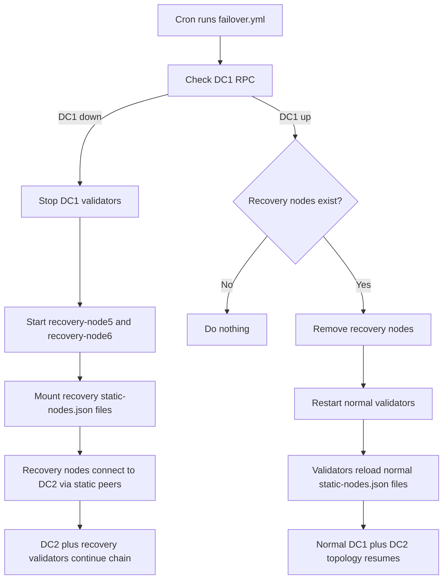

# Disaster Recovery Redesign Proposal

This proposal redesigns the local Docker-based Besu disaster recovery experiment so it does not use `ADMIN` RPC or `admin_addPeer`.

The experiment still models two separate data centers:

- DC1: original validators `besu-dc1-node1` and `besu-dc1-node2`
- DC2: surviving validators `besu-dc2-node3` and `besu-dc2-node4`
- Recovery in DC2: temporary validators `besu-recovery-node5` and `besu-recovery-node6`

Recovery nodes intentionally reuse DC1 validator keys. Because of that, the automation must ensure original DC1 validators and their recovery replacements are not active at the same time.

## Decision

Do not use `ADMIN` RPC.

Do not use `admin_addPeer`.

Use Besu static peer files instead:

```text
--static-nodes-file=/opt/besu/static-nodes.json
```

The static peer files live in:

```text
network/static-peers/
  dc1-node1/static-nodes.json
  dc1-node2/static-nodes.json
  dc2-node3/static-nodes.json
  dc2-node4/static-nodes.json
  recovery-node5/static-nodes.json
  recovery-node6/static-nodes.json
```

Each node gets a static list of peer enodes through a read-only Docker volume mount.

## Why ADMIN RPC Is Removed

`ADMIN` RPC allows runtime node administration. It can change peer connectivity and other operational behavior. It is useful in a lab, but it is not acceptable for a production-style design if exposed incorrectly.

This redesign treats peer topology as configuration, not an RPC operation.

Normal JSON-RPC APIs are limited to:

```text
ETH,NET,QBFT,WEB3
```

## Target Behavior

The DR controller is still the Ansible playbook:

```text
ansible/playbooks/failover.yml
```

Cron runs it every minute.

The playbook should be idempotent:

- If DC1 is healthy and no recovery nodes exist, do nothing.
- If DC1 is down, start recovery nodes in DC2.
- If DC1 is back and recovery nodes exist, remove recovery nodes and restart normal validators.

## Failover Flow

Failover starts when DC1 RPC on `localhost:8545` is unreachable.

Steps:

1. Check whether recovery containers already exist.
2. Stop DC1 validator containers to avoid duplicate validator keys.
3. Start `besu-recovery-node5` using `dc1-node1` keys.
4. Start `besu-recovery-node6` using `dc1-node2` keys.
5. Mount recovery static peer files into both recovery containers.
6. Wait for recovery RPC endpoints `8549` and `8550`.
7. Let Besu connect using `static-nodes.json`.
8. Log the failover event.

Recovery node static peers include:

- `besu-dc2-node3`
- `besu-dc2-node4`
- the other recovery node

## Failback Flow

Failback starts when DC1 RPC on `localhost:8545` responds again and recovery containers exist.

Steps:

1. Remove `besu-recovery-node5`.
2. Remove `besu-recovery-node6`.
3. Restart normal validators:
   - `besu-dc1-node1`
   - `besu-dc1-node2`
   - `besu-dc2-node3`
   - `besu-dc2-node4`
4. Wait for RPC endpoints `8545`, `8546`, `8547`, `8548`.
5. Let all validators reconnect using their mounted `static-nodes.json` files.
6. Log the failback event.

Temporary downtime during failback is acceptable in this experiment. The restart is intentional because recovery nodes reuse DC1 validator keys, and overlapping validator identities can leave QBFT in a bad round state.

## Static Peer Topology

Normal validator static peer files use the shared Docker network addresses:

```text
dc1-node1: 172.22.0.2
dc1-node2: 172.22.0.3
dc2-node3: 172.22.0.4
dc2-node4: 172.22.0.5
```

Recovery validator addresses:

```text
recovery-node5: 172.22.0.6
recovery-node6: 172.22.0.7
```

Each normal validator static file contains the other three normal validators.

Each recovery static file contains the two DC2 validators and the other recovery validator.

## Diagram



## Safety Rule

These pairs must not run together:

```text
besu-dc1-node1 and besu-recovery-node5
besu-dc1-node2 and besu-recovery-node6
```

They use the same validator keys.

The failover playbook stops DC1 validators before starting recovery validators to reduce the chance of duplicate validator identities.

## Verification Commands

Check block height:

```bash
curl -s -X POST http://localhost:8545 \
  -H 'Content-Type: application/json' \
  -d '{"jsonrpc":"2.0","method":"eth_blockNumber","params":[],"id":1}'
```

Check peer count:

```bash
curl -s -X POST http://localhost:8545 \
  -H 'Content-Type: application/json' \
  -d '{"jsonrpc":"2.0","method":"net_peerCount","params":[],"id":1}'
```

Check enabled APIs indirectly by ensuring `admin_addPeer` is not available. It should not be used by automation and should not appear in the playbooks.

```bash
grep -R "admin_addPeer\|ADMIN" ansible dc1 dc2 static-peers
```

Expected result: no matches.

## Current Limitations

This is still a local Docker experiment.

The next improvement would be a stronger state machine, for example:

```text
/tmp/besu-dr-state
```

Possible states:

```text
normal
failed-over
failing-back
```

That would make the cron-driven controller easier to reason about and avoid repeated log events.
