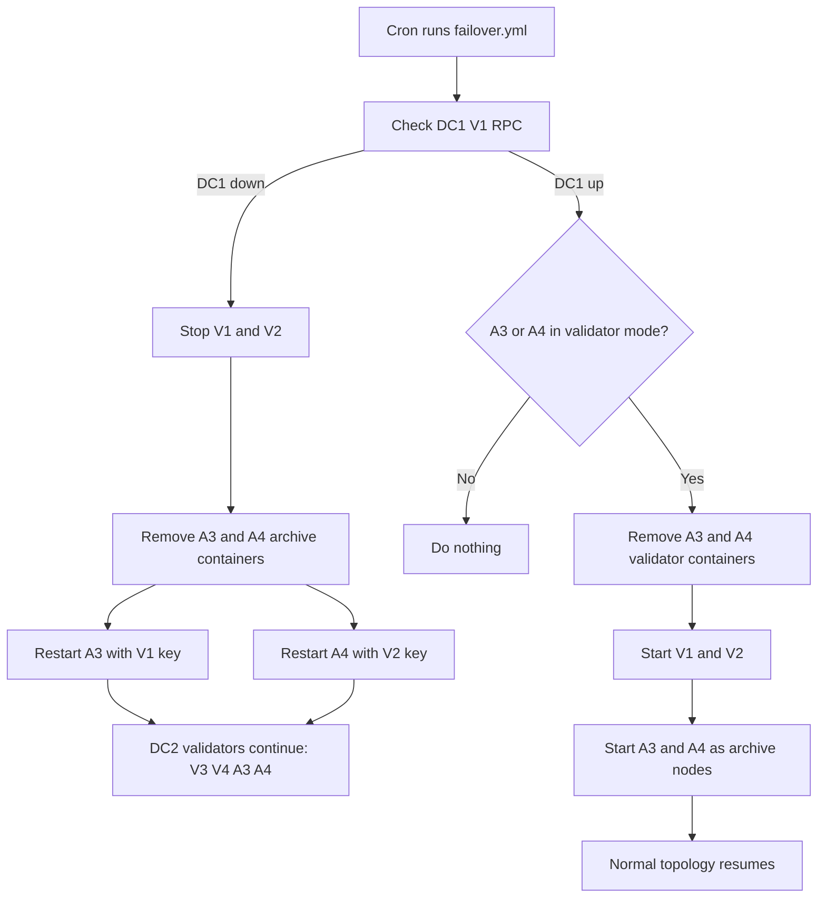

# Disaster Recovery Redesign Proposal

This proposal describes the local Docker-based Besu disaster recovery experiment after removing `ADMIN` RPC and `admin_addPeer`.

The design now uses archive nodes as warm standby validators. Archive nodes provide read RPC during normal operation. If DC1 fails, the DC2 archive nodes `A3` and `A4` are restarted with the DC1 validator keys so they temporarily replace `V1` and `V2` in consensus.

## Goals

- Keep peer topology as static configuration, not runtime RPC mutation.
- Keep `ADMIN` RPC disabled everywhere.
- Keep archive/read endpoints available in both data centers during normal operation.
- Let DC2 continue block production when DC1 is down by promoting `A3` and `A4`.
- Avoid RPC port conflicts during failback.
- Avoid duplicate validator keys during failover and failback.

## Normal Topology

```text
DC1:
  V1  besu-dc1-node1       validator       RPC 8545  P2P 172.22.0.2
  V2  besu-dc1-node2       validator       RPC 8546  P2P 172.22.0.3
  A1  besu-dc1-archive1    archive/read    RPC 8551  P2P 172.22.0.6
  A2  besu-dc1-archive2    archive/read    RPC 8552  P2P 172.22.0.7

DC2:
  V3  besu-dc2-node3       validator       RPC 8547  P2P 172.22.0.4
  V4  besu-dc2-node4       validator       RPC 8548  P2P 172.22.0.5
  A3  besu-dc2-archive3    archive/read    RPC 8553  P2P 172.22.0.8
  A4  besu-dc2-archive4    archive/read    RPC 8554  P2P 172.22.0.9
```

Archive nodes run all the time so their data stays warm. They use their own non-validator node keys during normal operation.

## Failover Topology

When DC1 is down, `A3` and `A4` are promoted in DC2:

```text
DC2:
  V3  besu-dc2-node3       validator, key V3
  V4  besu-dc2-node4       validator, key V4
  A3  besu-dc2-archive3    validator, key V1, RPC 8553, P2P 172.22.0.8
  A4  besu-dc2-archive4    validator, key V2, RPC 8554, P2P 172.22.0.9
```

`A3` and `A4` keep their stable RPC ports. They do not take `V1` or `V2` host ports. This allows DC1 containers to be started later without Docker port conflicts.

## Safety Rule

These pairs must never run at the same time:

```text
besu-dc1-node1 and besu-dc2-archive3 using V1 key
besu-dc1-node2 and besu-dc2-archive4 using V2 key
```

The problem is not RPC port conflict. The problem is duplicate QBFT validator identity.

The failover playbook stops DC1 validators before promoting `A3` and `A4`.

## Archive Storage

Archive nodes use:

```text
--sync-mode=FULL
--data-storage-format=FOREST
```

`FOREST` is used because these nodes are intended to act as archive/read nodes. The same data volume is reused when `A3` and `A4` switch between archive mode and validator mode.

Important: the archive data volume should be initialized with `FOREST` from the first node start. Do not switch an existing Bonsai data directory to Forest.

## RPC APIs

Archive/read mode exposes only read APIs:

```text
ETH,NET,WEB3
```

Validator mode exposes QBFT as well:

```text
ETH,NET,QBFT,WEB3
```

`ADMIN` is not enabled in either mode.

## Static Peer Files

All nodes use:

```text
--static-nodes-file=/opt/besu/static-nodes.json
```

Static peer files live under:

```text
network/static-peers/
```

`A3` and `A4` have separate static peer files for archive mode and validator mode because their node identity changes when their private key changes:

```text
dc2-archive3-archive/static-nodes.json
dc2-archive4-archive/static-nodes.json
dc2-archive3-validator/static-nodes.json
dc2-archive4-validator/static-nodes.json
```

In validator mode:

- `A3` uses the `V1` validator key at `172.22.0.8`.
- `A4` uses the `V2` validator key at `172.22.0.9`.

## Failover Flow

The controller is:

```text
ansible/playbooks/failover.yml
```

Cron runs it every minute in the lab.

When DC1 RPC on `localhost:8545` is unreachable:

1. Inspect current `A3` and `A4` mode labels.
2. Stop `besu-dc1-node1` and `besu-dc1-node2`.
3. Remove `besu-dc2-archive3` archive-mode container.
4. Recreate `besu-dc2-archive3` with the `V1` key, validator APIs, and validator static peers.
5. Remove `besu-dc2-archive4` archive-mode container.
6. Recreate `besu-dc2-archive4` with the `V2` key, validator APIs, and validator static peers.
7. Wait for `A3` and `A4` RPC on ports `8553` and `8554`.
8. Log the failover event.

The `A3` and `A4` containers are labeled:

```text
besu.dr.mode=validator
```

That keeps repeated cron runs idempotent while DC1 remains down.

## Failback Flow

When both DC1 validator RPC endpoints respond and `A3` or `A4` is in validator mode:

1. Remove `A3` and `A4` validator-mode containers.
2. Start `V1` and `V2` through the DC1 Docker Compose file.
3. Start `A3` and `A4` through the DC2 Docker Compose file so they return to archive/read mode.
4. Wait for normal validator and archive RPC endpoints.
5. Log the handback event.

The `A3` and `A4` containers return to:

```text
besu.dr.mode=archive
```

Temporary downtime during failback is acceptable in this lab.

Partial DC1 recovery is not enough for failback. If only one DC1 validator comes back, the controller keeps failover active and fences both DC1 validators. This avoids a duplicate validator key, for example `besu-dc1-node2` running at the same time as `besu-dc2-archive4` using the `V2` key.

## Diagram



## Verification Commands

Check block height:

```bash
curl -s -X POST http://localhost:8545 \
  -H 'Content-Type: application/json' \
  -d '{"jsonrpc":"2.0","method":"eth_blockNumber","params":[],"id":1}'
```

Check peer count:

```bash
curl -s -X POST http://localhost:8553 \
  -H 'Content-Type: application/json' \
  -d '{"jsonrpc":"2.0","method":"net_peerCount","params":[],"id":1}'
```

Check that `ADMIN` is disabled:

```bash
curl -s -X POST http://localhost:8553 \
  -H 'Content-Type: application/json' \
  -d '{"jsonrpc":"2.0","method":"admin_peers","params":[],"id":1}'
```

Expected result:

```text
Method not enabled
```

Search automation and compose config:

```bash
grep -R "admin_addPeer\|ADMIN" ansible dc1 dc2 static-peers
```

Expected result: no matches.
